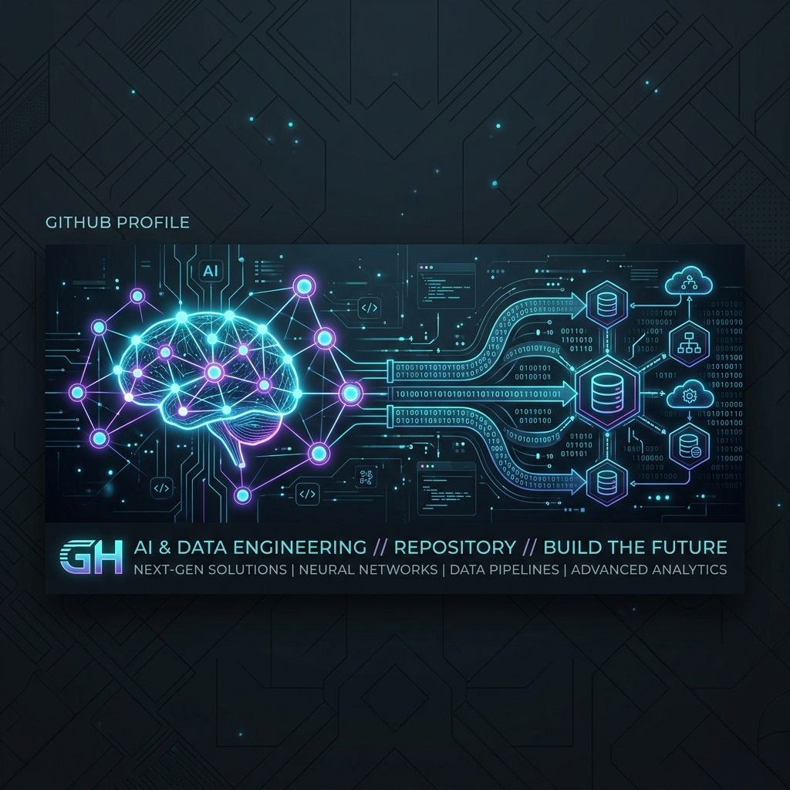

  
  
  # Hey there, I'm Anurag 👋
  
  ### AI Engineer | Data Systems | Building scalable automation 🚀
  
  

    
    
  

---

### 🚀 About Me

I design and build AI-powered systems, data pipelines, and automation tools that solve real-world problems at scale. I am a passionate **AI Engineer** transitioning into deeper **Data Engineering** territory, focusing on turning complex data into usable, intelligent products.

- 🧠 **AI Focus**: LLMs, AI Agents, Automation, and Computer Vision.
- 🏗️ **Data Focus**: ETL/ELT pipelines, Snowflake, dbt, and Cloud Data Warehousing.
- ⚡ **Engineering**: FastAPI, Python, Azure, and high-performance scraping.

---

### 🚀 Featured Projects

| Project | Description |
| :--- | :--- |
| **🔹 Intelligent Talent Suite** | AI-driven toolkit designed to enhance and evaluate candidate profiles. Includes resume optimization, automated screening, and interview assistance workflows powered by LLMs. |
| **🔹 Knowledge Assistant** | A retrieval-based AI system (RAG) that enables conversational access to large document repositories. |
| **🔹 Report Opt Engine** | Analyzes large sets of reports to identify redundancy and consolidate similar logic using AI-assisted query generation. |
| **🔹 Financial Anomaly Pipeline** | End-to-end data pipeline on Snowflake & DBT to identify suspicious transactions in high-volume financial data. |

---

### 🛠️ Tech Stack & Skills

  
<b>Artificial Intelligence & ML</b>

   
  
  
  
  

  
<b>Data Engineering & Cloud</b>

   
  
  
  
  

  
<b>Tools & Others</b>

   
  
  
  

---

### 📊 GitHub Metrics

  
  

  

---

### 📫 Connect With Me

  
  

   
  ⚡ <b>Philosophy:</b> Build. Ship. Improve. Repeat. Focus on real-world impact over hype.
    
  <i>"Turning data into intelligence, one pipeline at a time."</i>

